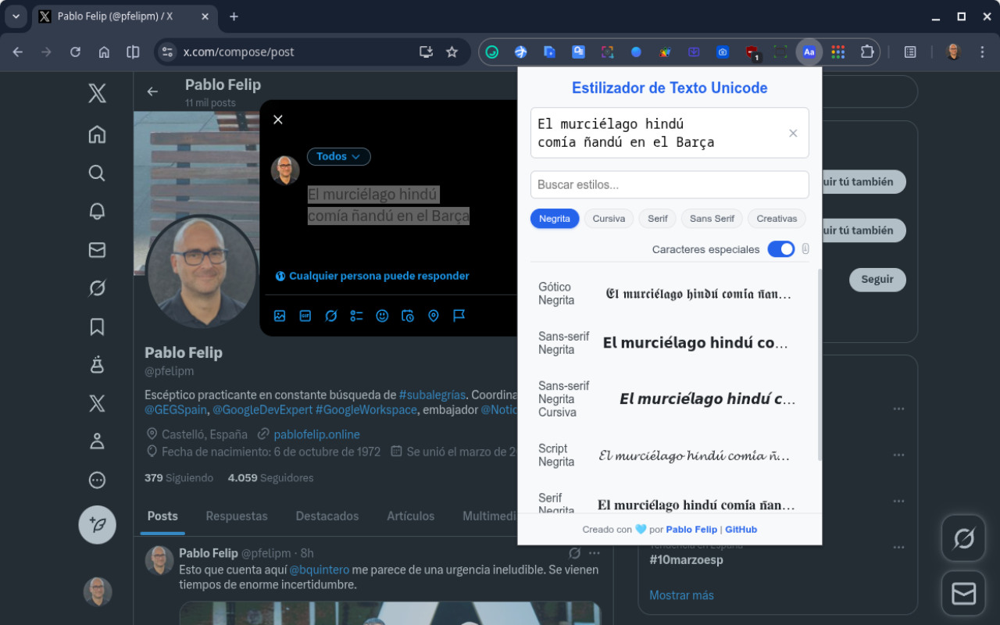
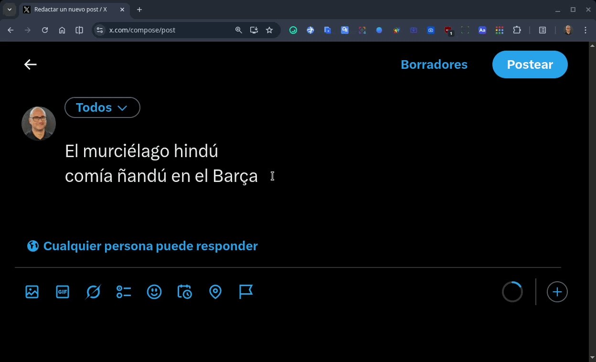

# Estilizador de texto Unicode

Dale personalidad a tus textos en cualquier página web. Convierte texto normal a diferentes estilos Unicode únicos con un solo clic y cópialo directamente a tu portapapeles.



## ✨ Características principales

Esta extensión ha sido diseñada para ser potente, rápida y fácil de usar.

* **Gran variedad de estilos:** Accede a más de 15 estilos de texto únicos, incluyendo Serif, Sans-serif, Gótico, Script, Superíndice y muchos más.
* **Captura de texto automática:** Al hacer clic en el icono de la extensión, el texto que tengas seleccionado en la página se cargará automáticamente.
* **Interfaz limpia y moderna:** Una ventana emergente diseñada para ser intuitiva y agradable a la vista, con un modo de scroll que mantiene los controles siempre visibles.
* **Buscador en tiempo real:** Filtra la lista completa de estilos al instante para encontrar el que necesitas sin esfuerzo.
* **Filtros por categorías:** Clasifica los estilos en categorías útiles (Negrita, Cursiva, Serif, Sans Serif y Creativos) para una navegación más rápida.
* **Soporte de caracteres especiales:** Incluye un modo para estilizar tildes (á, é...), la ñ y la ç mediante una técnica avanzada de composición Unicode (NFD).
* **Acceso rápido:** La extensión recuerda el último estilo que usaste y lo coloca al principio de la lista para tu comodidad.

* **Controles útiles:** Incluye un botón para limpiar el área de texto con un solo clic.
* **Feedback visual:** Confirma que has copiado un estilo con una animación sutil en la propia tarjeta y una notificación.
* **Ligera y rápida:** Construida con HTML, CSS y JavaScript puros, sin frameworks pesados, para un rendimiento óptimo.
* **Manifest V3:** Totalmente compatible con la última versión del manifiesto de extensiones de Chrome.


*En esta animación se muestra el nuevo interruptor para activar el soporte de estilizado de caracteres especiales.*

## 🎨 Estilos incluidos

La extensión cuenta con una cuidada selección de los estilos más populares y útiles:

* Sans-serif (Negrita, Cursiva, Negrita Cursiva)
* Serif (Negrita, Cursiva, Negrita Cursiva)
* Gótico (Normal, Negrita)
* Script (Negrita)
* Círculos y Cuadrados
* Superíndice y Letra Pequeña (Small Caps)
* Doble Trazo y Monoespaciado
* Tachado, Subrayado e Invertido

## 🚀 Instalación

Puedes instalar esta extensión en tu cuenta de Google desde su [ficha](https://chromewebstore.google.com/detail/mmhadiodfkknlpbfomkadpechfhbejcg?utm_source=item-share-cb) en la Chrome Web Store (recomendado) o de manera local en cada uno de tus navegadores siguiendo estos pasos:

1.  Descarga y descomprime o clona este repositorio:
    ```bash
    git clone https://github.com/pfelipm/chrome-unicode-styler.git
    ```
2.  Abre Google Chrome y ve a la página de extensiones: `chrome://extensions`.
3.  Activa el **"Modo de desarrollador"** en la esquina superior derecha.
4.  Haz clic en el botón **"Cargar descomprimida"**.
5.  Selecciona la carpeta del proyecto que acabas de descargar.
6.  ¡Listo! El icono de la extensión aparecerá en tu barra de extensiones, te sugiero que lo fijes a ella para usarlo con mayor comodidad.


## 💙 Créditos

Este proyecto ha sido creado y desarrollado por [Pablo Felip](https://www.linkedin.com/in/pfelipm).


## ✊ Licencia

Este proyecto se distribuye bajo los términos del archivo [LICENSE](/LICENSE).